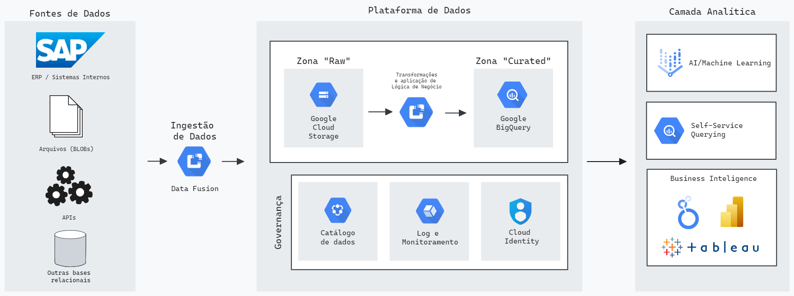

# Gourmet

"Olá rapadurinha"

## Terceiro Entregável



A arquitetura tem três grandes camadas:

1. Fonte de dados: aqui estão todas as fontes de dados que serão utilizadas e conectadas ao nosso datalake incluindo a fonte das notas fiscais (API), outros banco relacionais, sistemas legados (ERP, CRMs etc) e arquivos binários.  
2. Plataforma de dados: A plataforma começa com rotinas de ingestão feitas através do Cloud Data Fusion; todas as carga vão para uma zona "Raw" onde os dados estão em sua versão mais original e não alterada (essa camada está toda em Google Cloud Storage); utilizando Data Fusion o time é capaz de aplicar regras de négocio e também fazer as transformações necessárias e passar os dados que estavam em zona "Raw" para uma zona "Curated".
A zona "Curated" possui dados aplicados ao negócio (tabelas de KPIs, cruzamento de dados) e também pode ser utilizada como feature store para modelos de machine learning; os dados em zona "Raw" e em zona "Curated" são catalogadas através do Data Catalog, esse catálogo pode ser disponibilizado para toda a empresa e tem a principal função de dar publicidade aos dados coletados. Além disso, habilitando o StackDriver é possível coletar, gerenciar e monitorar todos os logs da plataforma (e seus jobs de ingestão de transformação de dados), incluindo latência, volume de carga entre outros KPIs importantes para gerenciamento de custo. Por fim, o Cloud Identity fornece uma foram simples e rápida de gerenciar acessos aos dados e pode ser associado a regras de segurança de dados para garantir a integridade de segurança da informação (só quem precisa pode ter acesso a dados e tudo é logado para auditoria futura).  
3. Camada analítica: A camada analítica utiliza os dados da zona "Curated" e ferramentas como o Vertex AI para criação de pipelines de treinamento contínuo de modelos de machine learning (e sua disponibilização), além de oferecer ferramentas de Business Intelligence como o Looker para construção de relatórios. Também existe a possibilidade da conexão entre zona "curated" e ferramentas de BI de outros parceiros como PowerBI e Tableau.

#### Ferramental utilizado

* Cloud Data Fusion: ambiente gerenciado para criação e execução de pipelines de ingestão de dados, escalável, já possui integração nativa com schedulers. Também oferece um conjunto de conectores padrão para diversas fontes e situações. Aumenta a velocidade de desenvolvimento e reduz tempo de manutenção.
* Google Data Storage: ambiente para armazenamento de arquivos BLOBs, com capacidade de versionamento de arquivos e também de configuração de rotinas de retenção de informação e prevenção de deleção de arquivos. 
* Google BigQuery: ferramental utilizado para construção e acesso a bases de dados "quentes" e constantemente utilizados pelo time analítico. Ofere uma interface simples para gestão de bases e editor de queries SQL para trabalhos de exploração. Em casos de bases sem necessidade de acesso constante é recomendado o uso de outras ferramentas (como o próprio Google Cloud Storage e CloudSQL)
* Data Catalog: ferramental para armazenamento e manutenção de metadados das bases oferecidas em zonas "Raw" e "Curated", oferece uma visualização unificada para pesquisa de dados e também auxilia oferecendo uma gestão de acesso a nível colunar para o BigQuery.
* Google Stackdriver: ferramental utilizado para gerenciamento e análise de logs em tempo real, composto pela junção do cloud monitoring e cloud logging. O cloud logging nos dá a possibilidade de criar métricas baseadas em logs e explorar todos os logs dos serviços habilitados, já o cloud monitoring vai nos dar uma interface simples para dashboards de logs e também um sistema de alarme. 
* Cloud Identity: o cloud identity já é um serviço habilitado em várias ferramentas citadas acima, ele nos dá a capacidade de gerenciar os usuários com acesso aos serviços da nossa aplicação e garante (se bem configurado) que as pessoas certas terão acesso ao que precisam para construir e manter a infraestrutura construída.
* Vertex AI: ambiente gerenciado para orquestração de pipelines de treinamento de modelos de machine learning, gerenciamento de versões de modelos (model registry), provisonamento de VMs para utilização de jupyter notebook, disponibilização rápida de modelos através de APIs, ferramentas integradas para detecção de drift e agendamento de retreinamento.   
* Looker: ferramenta para construção de visualizações, relatórios e dashboards com fácil integração em ambiente web, integração rápida com serviços como BQ e GCS e possui uma biblioteca de conectores padrão que podem ser utilizados para conexão com fontes externas de dados.
* Outras ferramentas de BI

### Vantagens da estrutura proposta

* Elasticidade Automática: A Capacidade de escalar recursos de forma automática e em tempo real, dependendo da demanda de carga de trabalho.
* Gestão da Infraestrutura: O GCP gerencia a infraestrutura, incluindo servidores, redes e sistemas operacionais.
* Modelo de Pagamento por Uso: Os custos são baseados no consumo real de recursos, sem a necessidade de investimento em hardware.
* Integração com Ferramentas de Análise e BI: Facilidade de integração com ferramentas de Business Inteligence (BI) e análise de Dados
* Custo-Eficiência: Reduz custos operacionais e de Capital, pois não há necessidade de comprar e manter hardware.
* Flexibilidade e Excalabilidade: Permite escalar recursos rapidamente para lidar com picos de demanda sem interrupções ou atrasos.
* Manutenção e Atualizações Automatizadas: A GCP cuida da manutenção e das atualizações, garantindo que o sistema esteja sempre atualizado e seguro.
* Foco no Uso dos Dados: Os usuários podem se concentrar na análise e no uso dos dados, em vez de se preocuparem com questões de infraestrutura.
* Tempo de Implementação Reduzido: Permite uma implementação mais rápida de soluções de armazenamento e analise de dados.
* Acessibilidade: Facilita o acesso a poderosas capacidades de armazenamento e processamento de dados para empresas de todos os tamanhos.


## Overview

This is your new Kedro project for the [spaceflights tutorial](https://docs.kedro.org/en/stable/tutorial/spaceflights_tutorial.html) and the extra tutorial sections on [visualisation with Kedro-Viz](https://docs.kedro.org/projects/kedro-viz/en/stable/kedro-viz_visualisation.html) and [experiment tracking with Kedro-Viz](https://docs.kedro.org/projects/kedro-viz/en/stable/experiment_tracking.html), which was generated using `kedro 0.19.2`.

Take a look at the [Kedro documentation](https://docs.kedro.org) to get started.

## Rules and guidelines

In order to get the best out of the template:

* Don't remove any lines from the `.gitignore` file we provide
* Make sure your results can be reproduced by following a [data engineering convention](https://docs.kedro.org/en/stable/faq/faq.html#what-is-data-engineering-convention)
* Don't commit data to your repository
* Don't commit any credentials or your local configuration to your repository. Keep all your credentials and local configuration in `conf/local/`

## How to install dependencies

Declare any dependencies in `requirements.txt` for `pip` installation.

To install them, run:

```
pip install -r requirements.txt
```

## How to run your Kedro pipeline

You can run your Kedro project with:

```
kedro run
```

## How to test your Kedro project

Have a look at the files `src/tests/test_run.py` and `src/tests/pipelines/test_data_science.py` for instructions on how to write your tests. Run the tests as follows:

```
pytest
```

To configure the coverage threshold, look at the `.coveragerc` file.

## Project dependencies

To see and update the dependency requirements for your project use `requirements.txt`. Install the project requirements with `pip install -r requirements.txt`.

[Further information about project dependencies](https://docs.kedro.org/en/stable/kedro_project_setup/dependencies.html#project-specific-dependencies)

## How to work with Kedro and notebooks

> Note: Using `kedro jupyter` or `kedro ipython` to run your notebook provides these variables in scope: `catalog`, `context`, `pipelines` and `session`.
>
> Jupyter, JupyterLab, and IPython are already included in the project requirements by default, so once you have run `pip install -r requirements.txt` you will not need to take any extra steps before you use them.

### Jupyter
To use Jupyter notebooks in your Kedro project, you need to install Jupyter:

```
pip install jupyter
```

After installing Jupyter, you can start a local notebook server:

```
kedro jupyter notebook
```

### JupyterLab
To use JupyterLab, you need to install it:

```
pip install jupyterlab
```

You can also start JupyterLab:

```
kedro jupyter lab
```

### IPython
And if you want to run an IPython session:

```
kedro ipython
```

### How to ignore notebook output cells in `git`
To automatically strip out all output cell contents before committing to `git`, you can use tools like [`nbstripout`](https://github.com/kynan/nbstripout). For example, you can add a hook in `.git/config` with `nbstripout --install`. This will run `nbstripout` before anything is committed to `git`.

> *Note:* Your output cells will be retained locally.

[Further information about using notebooks for experiments within Kedro projects](https://docs.kedro.org/en/develop/notebooks_and_ipython/kedro_and_notebooks.html).
## Package your Kedro project

[Further information about building project documentation and packaging your project](https://docs.kedro.org/en/stable/tutorial/package_a_project.html).
